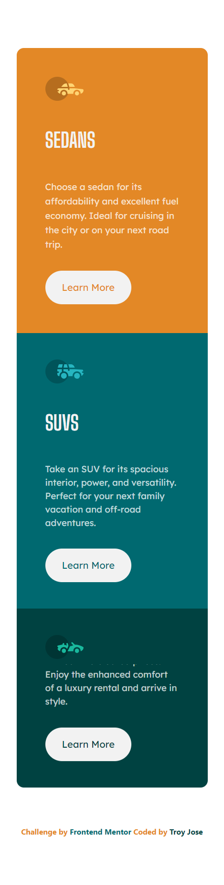
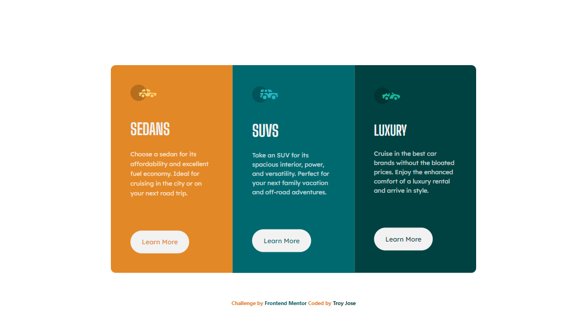

# Frontend Mentor - 3-column preview card component solution

This is a solution to the [3-column preview card component challenge on Frontend Mentor](https://www.frontendmentor.io/challenges/3column-preview-card-component-pH92eAR2-). Frontend Mentor challenges help you improve your coding skills by building realistic projects. 

## Table of contents

- [Overview](#overview)
  - [The challenge](#the-challenge)
  - [Screenshot](#screenshot)
  - [Links](#links)
  - [Built with](#built-with)
  - [What I learned](#what-i-learned)
  - [Continued development](#continued-development)
- [Author](#author)

## Overview

This challenge is perfect if you're just getting started. The shift between the layouts will be a nice test if you're new to building responsive projects.

### The challenge

Users should be able to:

- View the optimal layout depending on their device's screen size
- See hover states for interactive elements

### Screenshot

### Links

- Solution URL: [Add solution URL here](https://your-solution-url.com)
- Live Site URL: [Add live site URL here](https://your-live-site-url.com)

### Built with

- Semantic HTML5 markup
- CSS custom properties
- Flexbox
- CSS Grid
- Mobile-first workflow
- Tailwind

### What I learned

I possess a solid understanding of CSS and Sass without the use of frameworks, and I am utilizing this project as an opportunity to gain insight into the workings of a CSS framework.

### Continued development

I am committed to furthering my knowledge and understanding of Tailwind CSS by dedicating time to studying and exploring it in greater depth.

## Author

- Frontend Mentor - [@troyjosedev](https://www.frontendmentor.io/profile/troyjosedev)
- Github - [@troyjosedev](https://github.com/troyjosedev)
