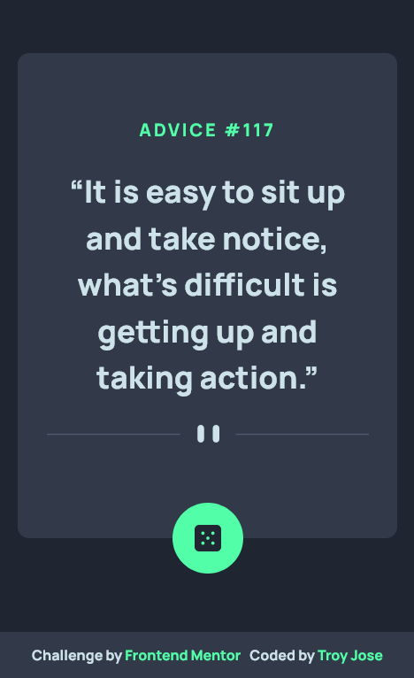
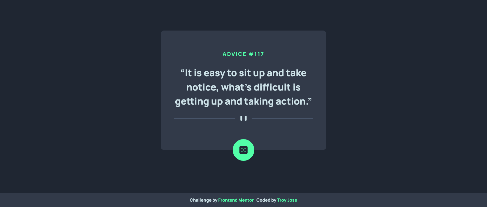

# Frontend Mentor - Advice generator app solution

This is a solution to the [Advice generator app challenge on Frontend Mentor](https://www.frontendmentor.io/challenges/advice-generator-app-QdUG-13db). Frontend Mentor challenges help you improve your coding skills by building realistic projects.

## Table of contents

- [Overview](#overview)
  - [The challenge](#the-challenge)
  - [Screenshot](#screenshot)
  - [Links](#links)
- [My process](#my-process)
  - [Built with](#built-with)
  - [What I learned](#what-i-learned)
  - [Continued development](#continued-development)
  - [Useful resources](#useful-resources)
- [Author](#author)
- [Acknowledgments](#acknowledgments)


## Overview

The perfect project if you're learning how to interact with 3rd-party APIs. This challenge uses the Advice Slip API to generate random quotes of advice.

### The challenge

Users should be able to:

- View the optimal layout for the app depending on their device's screen size
- See hover states for all interactive elements on the page
- Generate a new piece of advice by clicking the dice icon

### Screenshot




### Links

- Solution URL: [Add solution URL here](https://your-solution-url.com)
- Live Site URL: [Add live site URL here](https://your-live-site-url.com)

## My process

  In MY JavaScript file, begin by writing the code to fetch advice from an API. I use the fetch function to make a GET request to the API endpoint. For example:

  ```javascript
fetch("https://api.adviceslip.com/advice")
  .then(response => response.json())
  .then(data => {
    // Process the fetched data
  })
  .catch(error => {
    // Handle any errors that occur during the fetch operation
});
```
  
### Built with

- Semantic HTML5 markup
- CSS custom properties
- Flexbox
- CSS Grid
- Mobile-first workflow
- API
- ES6

### What I learned

Through the development of this advice generator project, I gained valuable experience and learned several key concepts:

- Working with APIs: I learned how to make HTTP requests to an external API using JavaScript's `fetch` function. This allowed me to retrieve random advice from the API and integrate it into my project.

- Asynchronous Programming: I explored asynchronous programming techniques by utilizing `async/await` syntax. This helped me handle asynchronous operations, such as fetching data from the API, in a more readable and concise manner.

- DOM Manipulation: I strengthened my understanding of manipulating the Document Object Model (DOM) using JavaScript. I learned how to select and modify HTML elements, update their content dynamically, and apply CSS styles to create visual effects.

- Error Handling: I gained experience in handling errors that may occur during API requests and implemented appropriate error handling mechanisms. This allowed me to handle potential issues gracefully and provide a better user experience.

- User Interaction: By implementing event listeners and handling button clicks, I learned how to create interactive features that respond to user actions. This enhanced the overall user experience of the advice generator.

- Project Organization: Throughout the development process, I focused on structuring my code effectively, separating concerns, and keeping the codebase clean and maintainable. This helped me improve my project organization skills.

```js

dice.addEventListener("click", function () {
  showQuote(); // When the dice button is clicked, call the showQuote function
});

async function showQuote() {
  try {
    const response = await fetch("https://api.adviceslip.com/advice"); // Fetch a random advice from the API
    const data = await response.json(); // Parse the response data
    console.log(data); 
    const advice = data.slip; // Extract the advice object from the data

    dice.style.filter = "blur(10px)"; // Apply a blur effect to the dice button
    adviceText.style.filter = "blur(10px)"; // Apply a blur effect to the advice text
    adviceText.textContent = advice.advice; // Set the advice text content to the fetched advice
    adviceNum.textContent = advice.id; // Set the advice number content to the fetched advice number

    setTimeout(() => {
      dice.style.filter = "none"; // Remove the blur effect from the dice button after a delay
      adviceText.style.filter = "none"; // Remove the blur effect from the advice text after a delay
    }, 1200);
  } catch (error) {
    console.error(`Error ${error}`); // Log any errors that occur during the fetch operation
  }
}
```
### Continued development

In future iterations, I plan to delve further into API integration and explore additional data-fetching techniques to enhance the functionality of the advice generator. I aim to expand my knowledge of different APIs and explore more advanced features such as authentication and data manipulation.

### Useful resources

- [MDN](https://developer.mozilla.org/en-US/) - MDN provides comprehensive documentation and guides for web technologies, including detailed explanations and examples on working with APIs. The articles on Fetch API and asynchronous programming were particularly valuable for understanding the concepts used in this project.

## Author

- Frontend Mentor - [@troyjosedev](hhttps://www.frontendmentor.io/profile/troyjosedev)
- Github - [@troyjosedev](https://github.com/troyjosedev)

## Acknowledgments

I would like to express my gratitude to [Frontend Mentor](https://www.frontendmentor.io/) for providing the challenge and design for this project. Their platform offers a wide range of design projects with different levels of complexity, helping developers like me enhance their skills and gain practical experience. I highly recommend Frontend Mentor to anyone looking to improve their web development skills and take on exciting design challenges.
