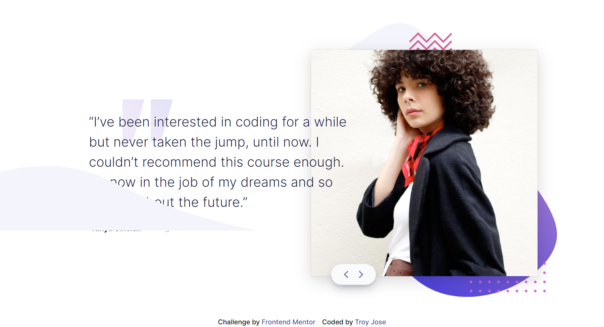

# Frontend Mentor - Coding bootcamp testimonials slider solution

This is a solution to the [Coding bootcamp testimonials slider challenge on Frontend Mentor](https://www.frontendmentor.io/challenges/coding-bootcamp-testimonials-slider-4FNyLA8JL). Frontend Mentor challenges help you improve your coding skills by building realistic projects. 

## Table of contents

- [Overview](#overview)
  - [The challenge](#the-challenge)
  - [Screenshot](#screenshot)
  - [Links](#links)
- [My process](#my-process)
  - [Built with](#built-with)
  - [What I learned](#what-i-learned)
  - [Continued development](#continued-development)
- [Acknowledgments](#acknowledgments)

## Overview
  This challenge will be a nice test if you're new to JavaScript. It's also a great opportunity to play around with content animations and transitions.
### The challenge

Users should be able to:

- View the optimal layout for the component depending on their device's screen size
- Navigate the slider using either their mouse/trackpad or keyboard

### Screenshot

#### Mobile


#### Desktop


### Links

- Solution URL:(https://github.com/troyjosedev/frontendmentor_challenge/tree/main/coding-bootcamp-testimonials-slider-master)
- Live Site URL:(https://testimonials-slider-troy03.netlify.app/)

## My process
-  I carefully reviewed the challenge requirements and made sure I had a clear understanding of what was expected, including the responsive layout and slider functionality.
### Built with

- Semantic HTML5 markup
- CSS custom properties
- Flexbox
- Mobile-first workflow
- ES6
- SCSS
- BEM Methodology

### What I learned

Building the slider functionality allowed me to enhance my JavaScript skills. I learned how to handle user interactions, such as mouse/trackpad navigation and keyboard support, and implemented smooth transitions and animations. This challenge helped me improve my understanding of event handling and manipulating the DOM dynamically.


Typically I used when there is content that needs to be available to assistive technologies, but is not necessary or desirable to be visible on the screen. It is often used as an alternative when a necessary header, such as an <h1> tag, is not present in the markup. 

```css
.sr-only {

    position: absolute;
    top: auto;
    height: 1px;
    width: 1px;
    overflow: hidden;
    clip: rect(1px, 1px, 1px, 1px);
    white-space: nowrap;
  }
```

### Continued development

 I will explore opportunities to enhance the user experience by adding more interactive elements, such as swipe gestures for touch-enabled devices or additional animation effects. I will also consider feedback and suggestions from users to identify areas of improvement and implement any desired enhancements.

## Acknowledgments


I would like to express my gratitude to [Frontend Mentor](https://www.frontendmentor.io/) for providing this challenge as a learning opportunity. Their platform offers a wide range of coding challenges and resources for front-end development, which have been instrumental in honing my skills.
