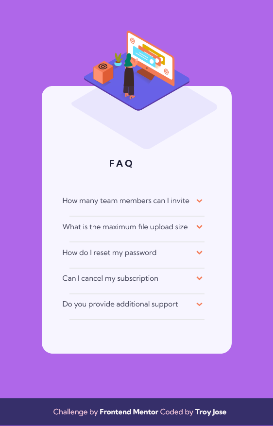

# Frontend Mentor - FAQ accordion card solution

This is a solution to the [FAQ accordion card challenge on Frontend Mentor](https://www.frontendmentor.io/challenges/faq-accordion-card-XlyjD0Oam). Frontend Mentor challenges help you improve your coding skills by building realistic projects. 

## Table of contents

- [Overview](#overview)
  - [The challenge](#the-challenge)
  - [Screenshot](#screenshot)
  - [Links](#links)
- [My process](#my-process)
  - [Built with](#built-with)
  - [What I learned](#what-i-learned)
  - [Continued development](#continued-development)
  - [Useful resources](#useful-resources)
- [Author](#author)
- [Acknowledgments](#acknowledgments)


## Overview
  In this challenge, you'll be building out an FAQ accordion. This is an extremely common front-end pattern, so it's a great opportunity to get some practice in!

### The challenge

Users should be able to:

- View the optimal layout for the component depending on their device's screen size
- See hover states for all interactive elements on the page
- Hide/Show the answer to a question when the question is clicked

### Screenshot




### Links

- Solution URL: [Add solution URL here](https://your-solution-url.com)
- Live Site URL: [Add live site URL here](https://your-live-site-url.com)

## My process

"In this project, I followed a systematic approach to achieve the desired outcome. I began by carefully planning and sketching the functionality and design of the accordion FAQ component. Through extensive research on resources such as CSS Tricks and Frontend Mentor, I gained valuable insights and inspiration. I then structured the HTML markup, implemented CSS styles, and conducted thorough testing and refinement to ensure a visually appealing and responsive accordion component."

### Built with

- Semantic HTML5 markup
- CSS custom properties
- Flexbox
- Mobile-first workflow
- ES6 Js

### What I learned

Using details and summary tag element to easily create accordion effect

```html
  <details>
    <summary  role="button" aria-controls="faq1-content" aria-expanded="false">How many team members can I invite</summary>
      <p id="faq1-content">You can invite up to 2 additional users on the Free plan. There is no limit on team members for the Premium plan.</p> 
  </details>
```
To position list images, like arrows, on the right side of the list, you can use CSS pseudo-elements. By targeting the <summary> element within the <details> element, you can use the ::after pseudo-element to add additional content to the summary. 

```css
summary::after {
  content: url(./images/icon-arrow-down.svg);
  position: absolute;
  right: -1.8em;
  transition: transform 0.3s ease; 
}
```

### Continued development

This project is an accordion FAQ component that allows for collapsible sections of frequently asked questions. It was created to provide an interactive and user-friendly way to present and organize information.

### Useful resources

- [CSS Gradient](https://www.example.comhttps://cssgradient.io/https://www.example.com) - Help me to  deepening my understanding of gradient usage and providing me with the necessary knowledge to incorporate gradients as backgrounds in my project."
- [CSS Tricks](https://css-tricks.com/exploring-what-the-details-and-summary-elements-can-do/) - The website provided valuable insights and guidance on utilizing the <details> and <summary> elements effectively. It significantly contributed to my knowledge and enabled me to implement a functional and user-friendly accordion component in my project."

## Author

- Frontend Mentor - [@troyjosedev](https://www.frontendmentor.io/profile/troyjosedev)
- Github - [@troyjosedev](https://github.com/troyjosedev)

## Acknowledgments

Special thanks to Frontend Mentor (https://www.frontendmentor.io/) for providing the design challenge that inspired this project. Their platform has been instrumental in honing my front-end development skills.

I would also like to acknowledge CSS Tricks (https://css-tricks.com/) for their invaluable resources and tutorials. Their content has helped me deepen my understanding of CSS and solve various challenges throughout this project.


