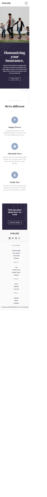
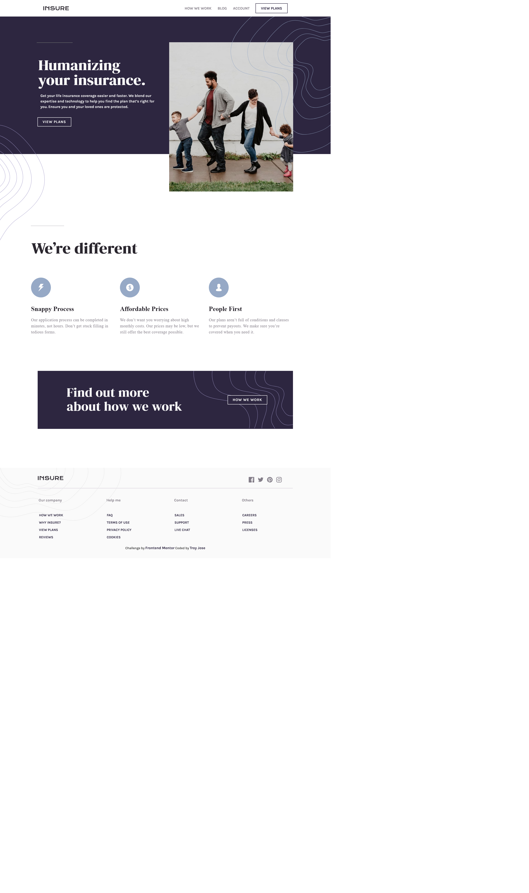

# Frontend Mentor - Insure landing page solution

This is a solution to the [Insure landing page challenge on Frontend Mentor](https://www.frontendmentor.io/challenges/insure-landing-page-uTU68JV8). Frontend Mentor challenges help you improve your coding skills by building realistic projects. 

## Table of contents

- [Overview](#overview)
  - [The challenge](#the-challenge)
  - [Screenshot](#screenshot)
  - [Links](#links)
- [My process](#my-process)
  - [Built with](#built-with)
  - [Continued development](#continued-development)

## Overview

Test your layout skills with this HTML & CSS only landing page. This challenge is perfect if you're starting to get confident in laying out web pages.

### The challenge

Users should be able to:

- View the optimal layout for the site depending on their device's screen size
- See hover states for all interactive elements on the page

### Screenshot

### Links

- Solution URL: [Add solution URL here](https://your-solution-url.com)
- Live Site URL: [Add live site URL here](https://your-live-site-url.com)

## My process
  
The initial step in my process is to create the navigation bar for both desktop and mobile versions. This component is considered challenging and crucial for the project. Therefore, I prioritize its development at the beginning.

### Built with

- Semantic HTML5 markup
- CSS custom properties
- Flexbox
- CSS Grid
- Mobile-first workflow
- Javascript

### What I learned

Proud to myself that I can build a landing page 

### Continued development

I create a project that use CSS framework and Javascript framework which is React.js abd learn different approach technique in layout and different ways of cuztomizing properties

