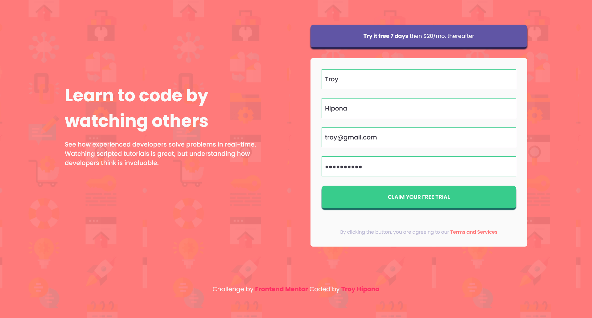

# Frontend Mentor - Intro component with sign up form solution

This is a solution to the [Intro component with sign up form challenge on Frontend Mentor](https://www.frontendmentor.io/challenges/intro-component-with-signup-form-5cf91bd49edda32581d28fd1). Frontend Mentor challenges help you improve your coding skills by building realistic projects. 

## Table of contents

- [Overview](#overview)
  - [The challenge](#the-challenge)
  - [Screenshot](#screenshot)
  - [Links](#links)
- [My process](#my-process)
  - [Built with](#built-with)
  - [What I learned](#what-i-learned)
  - [Continued development](#continued-development)
  - [Useful resources](#useful-resources)
- [Author](#author)
- [Acknowledgments](#acknowledgments)

## Overview

Practice building out a sign-up form complete with client-side validation using JavaScript.

### The challenge

Users should be able to:

- View the optimal layout for the site depending on their device's screen size
- See hover states for all interactive elements on the page
- Receive an error message when the `form` is submitted if:
  - Any `input` field is empty. The message for this error should say *"[Field Name] cannot be empty"*
  - The email address is not formatted correctly (i.e. a correct email address should have this structure: `name@host.tld`). The message for this error should say *"Looks like this is not an email"*

### Screenshot

#### Mobile


#### Desktop



### Links

- Solution URL: [Github Repo](https://github.com/troyjosedev/frontendmentor_challenge/tree/main/intro-component-with-signup-form-master)
- Live Site URL: [Netlify Live Site](https://intro-component-sign-up-troy.netlify.app/)

## My process
    - I implemented form validation by utilizing HTML5 form validation attributes and JavaScript code to enforce specific input rules and display appropriate warning messages.
    - By selecting form input elements and their corresponding warning elements, I added event listeners to handle input validity checks and dynamically show or hide warning messages based on user input.
    - Finally, I ensured the form's submission is prevented if any input is invalid, and added a check to log a success message to the console when the form is valid and ready for submission.

### Built with

- Semantic HTML5 markup
- CSS custom properties
- Flexbox
- CSS Grid
- Mobile-first workflow
- Javascript

### What I learned

Handle the validity of form

```js
const handleValidity = (inputElement, warningElement) => {
  if (inputElement.validity.valid) {
    inputElement.classList.remove('invalid');
    warningElement.style.display = 'none';
  } else {
    inputElement.classList.add('invalid');
    warningElement.style.display = 'block';
  }
};
```

### Continued development

I will explore different input types such as numbers or specific patterns to enhance the form validation. By adjusting the validation rules and error messages, I can provide more accurate feedback based on the expected input format. Additionally, I will implement additional validation logic for fields like passwords or phone numbers to ensure they meet specific criteria.


### Useful resources

- [MDN Form Validation](https://developer.mozilla.org/en-US/docs/Learn/Forms/Form_validation) -  This resource from MDN (Mozilla Developer Network) provided comprehensive information on form validation techniques. It was particularly helpful in understanding the various attributes, methods, and events associated with form validation in HTML and JavaScript. I found the examples and explanations easy to follow, and it greatly assisted me in implementing form validation for my project.

## Author

- Frontend Mentor - [@troyjosedev](https://www.frontendmentor.io/profile/troyjosedev)
- Github - [@troyjosedev](https://github.com/troyjosedev)

## Acknowledgments

Acknowledgments

I would like to express my gratitude to Frontend Mentor for providing the project challenge that inspired me to create this form validation feature. Their platform offers a diverse range of design projects with varying levels of difficulty, allowing developers to enhance their skills and showcase their work. I also appreciate the supportive community on Frontend Mentor, where members can seek feedback and learn from one another's solutions. 
