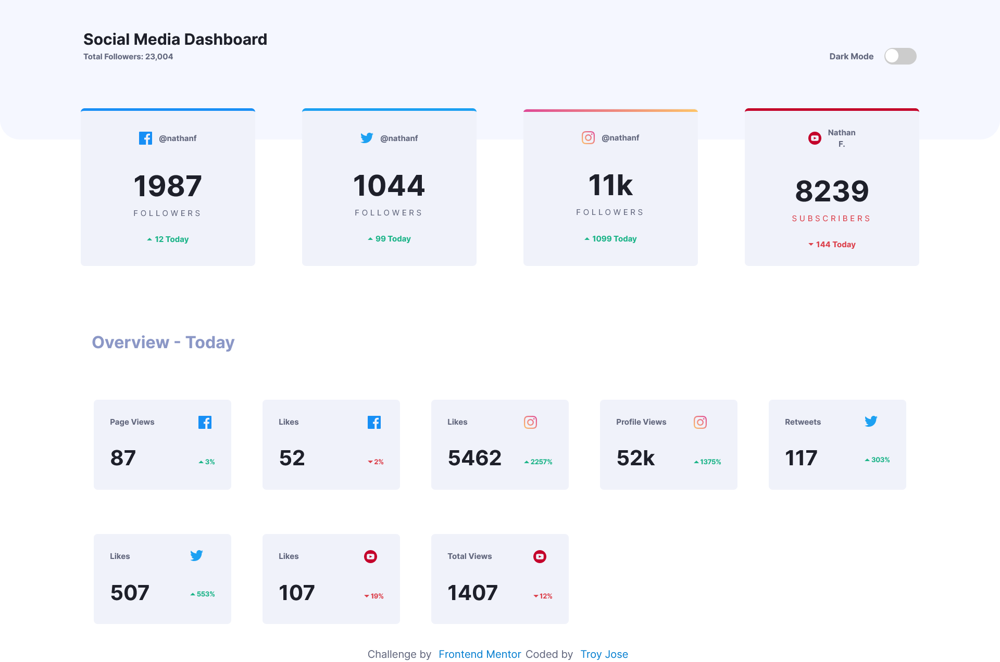

# Frontend Mentor - Time tracking dashboard solution

This is a solution to the [Social media dashboard with theme switcher](https://www.frontendmentor.io/challenges/social-media-dashboard-with-theme-switcher-6oY8ozp_H/hub). Frontend Mentor challenges help you improve your coding skills by building realistic projects. 

## Table of contents

- [Overview](#overview)
  - [The challenge](#the-challenge)
  - [Screenshot](#screenshot)
  - [Links](#links)
  - [Built with](#built-with)
  - [Continued development](#continued-development)
  - [Useful resources](#useful-resources)
- [Author](#author)

## Overview
This challenge will be a perfect chance to practice your Grid skills. The color theme switcher also adds a nice additional test.

### The challenge

Users should be able to:

- View the optimal layout for the site depending on their device's screen size
- See hover states for all interactive elements on the page
- Switch between viewing Daily, Weekly, and Monthly stats

### Screenshot

#### Mobile

#### Desktop

### Links

- Solution URL: [Github Repo]()
- Live Site URL: [Netlify Live Site]()

### Built with

- Semantic HTML5 markup
- CSS Flexbox
- CSS Grid
- Mobile-first workflow
- ES6
- React.js
- SCSS

### Continued development

In future projects, I plan to study more react hooks and apply to the future project and learn state management

### Useful resources

- [React Docs](https://react.dev//): This provides comprehensive documentation on React.js.

## Author

- Frontend Mentor - [@troyjosedev](https://www.frontendmentor.io/profile/troyjosedev)
- Github - [@troyjosedev](https://github.com/troyjosedev)
