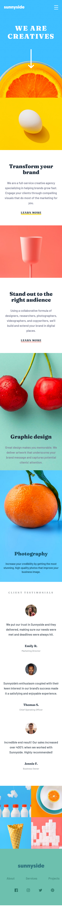
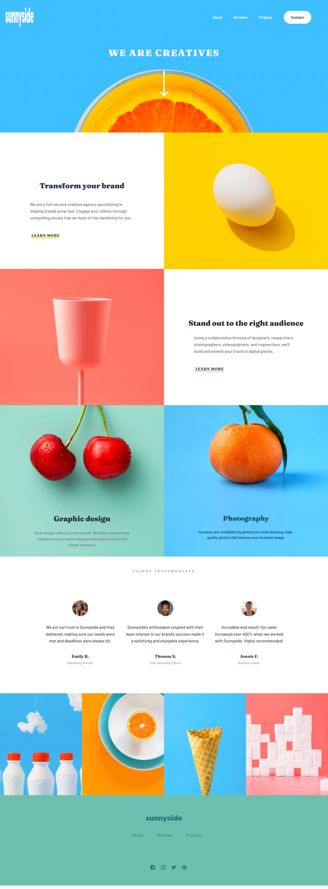

# Frontend Mentor - Sunnyside agency landing page solution

This is a solution to the [Sunnyside agency landing page challenge on Frontend Mentor](https://www.frontendmentor.io/challenges/sunnyside-agency-landing-page-7yVs3B6ef). Frontend Mentor challenges help you improve your coding skills by building realistic projects.

## Table of contents

- [Overview](#overview)
  - [The challenge](#the-challenge)
  - [Screenshot](#screenshot)
  - [Links](#links)
- [My process](#my-process)
  - [Built with](#built-with)
  - [What I learned](#what-i-learned)
  - [Continued development](#continued-development)
  - [Useful resources](#useful-resources)
- [Author](#author)
- [Acknowledgments](#acknowledgments)

## Overview

### The challenge

Users should be able to:

- View the optimal layout for the site depending on their device's screen size
- See hover states for all interactive elements on the page
- Best view espesifically in 375px and 1440px

### Screenshot
#### Mobile

#### Desktop

### Links

- Solution URL: [Github Repo](https://github.com/troyjosedev/frontendmentor_challenge/tree/main/sunnyside-agency-landing-page-main)
- Live Site URL: [Netlify Live Site](https://sunnysidelandingpagetroy.netlify.app/)

## My process
  Adopting a mobile-first approach and focusing on creating a solution that works well between the screen sizes of 375px and 1440px. Have been relearning animation techniques to achieve a bouncing effect for an arrow element. Additionally, I'm conducting research on implementing a hamburger menu for my project.

### Built with

- Semantic HTML5 markup
- CSS custom properties
- Flexbox
- CSS Grid
- Mobile-first workflow
- SCSS

### What I learned

  During my recent exploration of CSS, I gained knowledge about the filter property and its various capabilities. By using the filter property, I can apply visual effects to elements in a flexible and creative way. One specific use case I discovered was the brightness() function, which allows me to adjust the brightness of an element by specifying a value between 0 and 1. This is particularly useful for creating dark or light mode themes.

  Another interesting aspect of the filter property is the invert() function. It enables me to invert the colors of an element, effectively flipping the color scheme. This can be a great way to create visual contrast or achieve unique design effects.

  Furthermore, I learned how to apply smooth transitions to the filter property. By specifying a transition duration and an easing function, I can create gradual and visually appealing changes when hovering or interacting with elements.

  Overall, the filter property has opened up new possibilities for me to enhance the visual aspects of my web designs and create engaging user experiences. I'm excited to explore more creative applications of this property in future projects.

### Continued development

  I am currently focused on advancing my skills in animating cross menu animations, image slideshows, modals, and other interactive elements. These features play a crucial role in creating engaging and dynamic user experiences on websites. By honing my abilities in these areas, I aim to bring life and interactivity to my web projects, making them more visually appealing and user-friendly. I will continue my learning journey, exploring different animation techniques and staying up-to-date with the latest trends and best practices in web development. With each new project, I strive to improve my proficiency in implementing these elements seamlessly and effectively.

### Useful resources

- [stackoverflow](https://stackoverflow.com/questions/24224112/css-filter-make-color-image-with-transparency-white) - This helped me fo understandting how I canfiltering image in white or black
- [CSS Tricks](https://css-tricks.com/) -  It provided me with invaluable insights and a clear understanding of the concept. If you're still in the process of learning about CSS property.

## Author

- Github - [troyjosedev ](https://github.com/troyjosedev)
- Frontend Mentor - [@troyjosedev](https://www.frontendmentor.io/home)

## Acknowledgments

  I would like to express my gratitude to Frontend Mentor for providing valuable resources and materials that have greatly aided me in my learning journey. Their platform has been instrumental in improving my frontend development skills and expanding my knowledge in various areas. I am thankful for the opportunities they offer and the support they provide to aspiring developers like myself.
