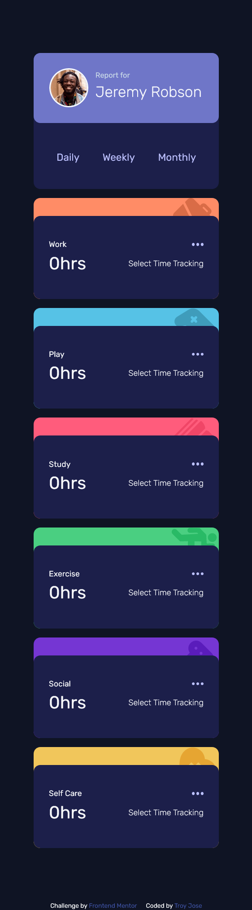
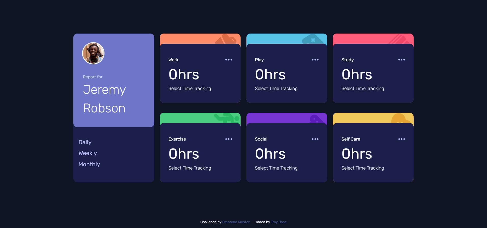

# Frontend Mentor - Time tracking dashboard solution

This is a solution to the [Time tracking dashboard challenge on Frontend Mentor](https://www.frontendmentor.io/challenges/time-tracking-dashboard-UIQ7167Jw). Frontend Mentor challenges help you improve your coding skills by building realistic projects. 

## Table of contents

- [Overview](#overview)
  - [The challenge](#the-challenge)
  - [Screenshot](#screenshot)
  - [Links](#links)
- [My process](#my-process)
  - [Built with](#built-with)
  - [What I learned](#what-i-learned)
  - [Continued development](#continued-development)
  - [Useful resources](#useful-resources)
- [Author](#author)
- [Acknowledgments](#acknowledgments)


## Overview
This challenge is to build out this dashboard and get it looking as close to the design as possible.

You can use any tools you like to help you complete the challenge. So if you've got something you'd like to practice, feel free to give it a go.

If you would like to practice working with JSON data, we provide a local data.json file for the activities. This means you'll be able to pull the data from there instead of using the content in the .html file.

### The challenge

Users should be able to:

- View the optimal layout for the site depending on their device's screen size
- See hover states for all interactive elements on the page
- Switch between viewing Daily, Weekly, and Monthly stats

### Screenshot

#### Mobile


#### Desktop


### Links

- Solution URL: [Github Repo](https://github.com/troyjosedev/frontendmentor_challenge/tree/main/time-tracking-dashboard-main#links)
- Live Site URL: [Netlify Live Site](https://time-tracking-time.netlify.app/)

## My process

  In the course of this project, I gained experience and knowledge in working with JSON data. I successfully utilized JSON to retrieve and manipulate data, allowing me to enhance the functionality and interactivity of my application.

### Built with

- Semantic HTML5 markup
- CSS custom properties
- CSS Grid
- Mobile-first workflow
- ES6
- JSON
- BEM
- SCSS


### What I learned

During this project, I learned how to effectively work with JSON data. I acquired knowledge in retrieving JSON data using the Fetch API, parsing JSON responses, and leveraging the data to dynamically update and modify elements on the webpage. This experience provided me with a deeper understanding of data manipulation and improved my overall proficiency in web development.

To see how you can add code snippets, see below:

```js

fetch('./data.json')
  .then(response => response.json())
  .then(jsonData => {
    
    daily.addEventListener('click', () => {
      updateCardData(jsonData, 'daily'); 
      setTextColor(daily);
    });

    weekly.addEventListener('click', () => {
      updateCardData(jsonData, 'weekly'); 
      setTextColor(weekly); 
    });

    monthly.addEventListener('click', () => {
      updateCardData(jsonData, 'monthly');
      setTextColor(monthly); 
    });
    
  })
  .catch(error => {
    console.log('Error:', error);
  });

```

### Continued development

In future projects, I plan to further enhance my skills in working with JSON data. Specifically, I would like to explore more advanced techniques such as handling nested JSON structures, implementing error handling for JSON parsing, and integrating JSON data with different APIs. Additionally, I aim to deepen my understanding of asynchronous JavaScript and explore other data manipulation and transformation methods to extract valuable insights from JSON data.


### Useful resources

- [MDN Web Docs](https://developer.mozilla.org/): MDN provides comprehensive documentation on JavaScript.

## Author

- Frontend Mentor - [@troyjosedev](https://www.frontendmentor.io/profile/troyjosedev)
- Github - [@troyjosedev](https://github.com/troyjosedev)

### Acknowledgments

I would like to acknowledge the following resources and individuals for their contributions to this project:

- [MDN Web Docs](https://developer.mozilla.org/): The MDN Web Docs website provided invaluable information and examples that helped me understand various JavaScript concepts and techniques.
- [Stack Overflow](https://stackoverflow.com/): The Stack Overflow community was a valuable resource for finding solutions to specific coding challenges and troubleshooting issues.
- [Online tutorials and articles](https://www.example.com/): I also want to express my gratitude to various online tutorials and articles that provided insights, tips, and tricks that enhanced my learning and problem-solving skills during the development of this project.

I am grateful for the collective knowledge shared by the programming community, which greatly contributed to the successful completion of this project.

